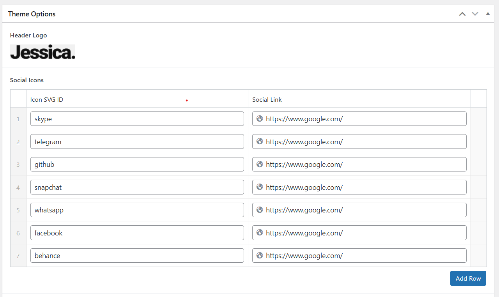

# Jessica Portfolio - WordPress Theme

A custom WordPress theme built from a static HTML template. This theme is fully dynamic, allowing for complete content management through the WordPress admin panel using Advanced Custom Fields (ACF).

---

### Features

- **Fully Dynamic Homepage:** Every section of the homepage is editable via custom fields on the page editor.
- **Theme Options Panel:** Global elements like the header/footer logo and social media links are managed from a central "Theme Settings" options page.
- **Custom Post Type for Portfolio:** A dedicated "Portfolio" section in the admin panel allows for easy management of portfolio items and categories, making the portfolio scalable and organized.
- **Modular Template Parts:** The theme is built using a modern, modular structure with template parts for each section, following WordPress best practices.
- **Plugin Integration:** Utilizes popular plugins like ACF, Classic Editor, CPT UI for structure, and WPForms for a functional contact form.

  
  
  
  
  
  
  <!--  -->

---

### Required Plugins

To use this theme, the following plugins must be installed and activated:

1.  **Advanced Custom Fields:** Powers all the custom content fields.
1.  **Classic Editor:** used for page editing.

1.  **Custom Post Type UI:** Used to create the "Portfolio" post type and its "Portfolio Category" taxonomy.
1.  **WPForms** (or any other form plugin): Used to create and manage the contact form. The theme uses a shortcode to display the form.

---

### Theme Setup & Configuration

1.  **Activate the Theme:** Place the `portfolio` folder in your `/wp-content/themes/` directory and activate it from the Appearance > Themes menu.
2.  **Install Plugins:** Install and activate the required plugins listed above.
3.  **Set the Homepage:** Go to `Settings > Reading` and set a static page as your "Homepage".
4.  **Configure Theme Settings:**

    - Navigate to the **"Theme Settings"** page in the admin menu.
    - Upload the **Header Logo** and **Footer Logo**.
    - Add your social media links using the **Social Icons** repeater. The "Icon SVG ID" must match an ID from the `<symbol>` definitions in `header.php` (e.g., `facebook`, `twitter`).
      

5.  **Create Menus:**

    - Go to **Appearance > Menus**.
    - Create a "Primary Menu" and assign it to the **"Primary Menu"** display location.
    - Create a "Footer Menu" and assign it to the **"Footer Menu"** display location.

6.  **Populate Homepage Content:**

    - Edit the page you set as your homepage.
    - Fill out all the ACF field groups (Homepage Banner, Feature Blocks, Info Columns, etc.) with your content.
    - Paste your WPForms shortcode into the "Form Shortcode" field in the Contact Section.

    

7.  **Add Portfolio Items:**
    - Go to **Portfolios > Portfolio Categories** to create your filter categories.
    - Go to **Portfolios > Add New** to add your work. Assign each item to one or more categories and upload a "Portfolio Image".

---

### Theme File Structure

The theme follows a standard WordPress structure, with a focus on modularity using template parts.

```text
/jessica-portfolio
|-- /css/           # Main theme stylesheets
|-- /images/        # Theme images (logos, fallbacks)
|-- /js/            # JavaScript files
|-- /template-parts/ # Modular PHP files for each homepage section
|   |-- section-banner.php
|   |-- section-contact.php
|   |-- section-faq.php
|   |-- ... (etc.)
|-- footer.php      # Footer template
|-- functions.php   # Theme logic, script enqueuing, ACF setup
|-- header.php      # Header template
|-- index.php       # Main theme file, calls template parts
|-- style.css       # Main stylesheet with theme info
|-- README.md       # This file
```

---

## Client Content Guide

Welcome to your new website! This guide will show you how to update all the content on your homepage and manage your portfolio.

---

### 1. Editing the Header and Footer (Global Content)

Global content like your logo, social media links, and contact info is managed in one central place.

- From the main WordPress menu, click on **"Theme Settings"**.
- Here you can:

  - Upload a new **Header Logo**.
  - Upload a new **Footer Logo**.
  - Update the **Footer Description** and **Contact Info**.
  - Add, remove, or change your **Social Icons** using the "Add Row" button.

  

---

### 2. Editing the Navigation Menus

- Go to **Appearance > Menus**.
- Select the menu you wish to edit (e.g., "Primary Menu" or "Footer Menu") from the dropdown.
- You can drag and drop menu items to reorder them.
- To add new items, select pages or add custom links from the panel on the left.
- Click **"Save Menu"**.

### 3. Editing the Homepage Content

All sections of the homepage are editable directly on the page editor.

- Go to **Pages** and click "Edit" on your homepage.
- You will see a series of boxes, each corresponding to a section on the page (e.g., "Homepage Banner", "Homepage Feature Blocks").
- Click on the title of any box to open it and edit the content inside.
- For sections with repeating items (like the "Info Columns" or "Testimonials"), you can use the "Add Row" button to add new items.
- When you are finished with your changes, click the blue **"Update"** button to save the page.

_[Screenshot of the homepage editor showing all the ACF metaboxes]_

---

### 4. Managing Your Portfolio

Your portfolio has its own dedicated section in the admin menu.

**To Add a New Portfolio Item:**

- Go to **Portfolios > Add New**.
- Enter a title for your work.
- On the right side, assign it to one or more **Portfolio Categories**.
- In the "Portfolio Item Settings" box, click **"Add Image"** to upload your work.
- Click **"Publish"**.

**To Add or Edit Portfolio Categories (The Filters):**

- Go to **Portfolios > Portfolio Categories**.
- Here you can add new categories or edit existing ones, which will automatically update the filter buttons on your homepage.

---

### 5. Managing the Contact Form

- The text content around the form ("Leave a Message", etc.) can be edited on the homepage editor in the "Homepage Contact Section" box.
- To change form settings (like the email address where submissions are sent), go to **WPForms** in the main admin menu, find your "Contact Form," and click "Edit".
